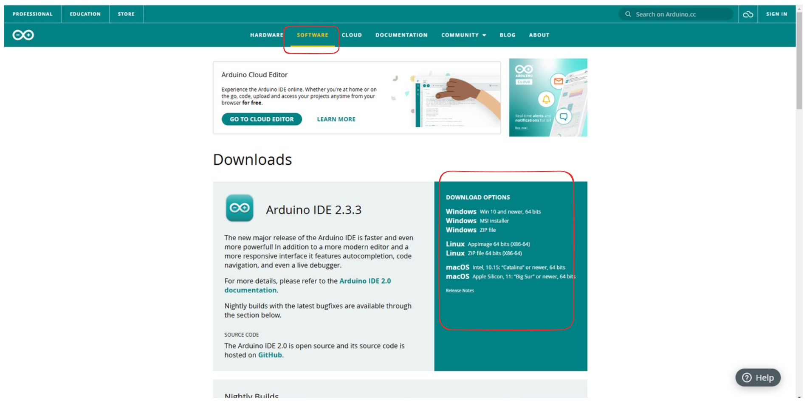
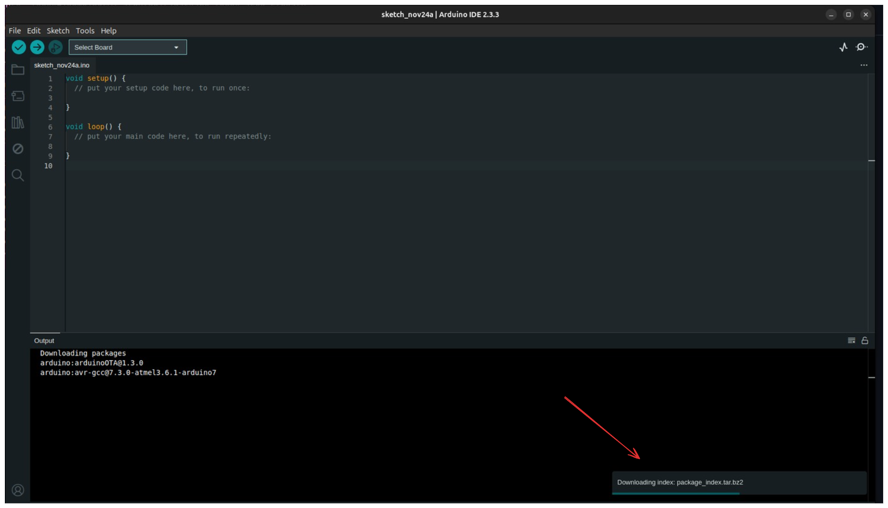
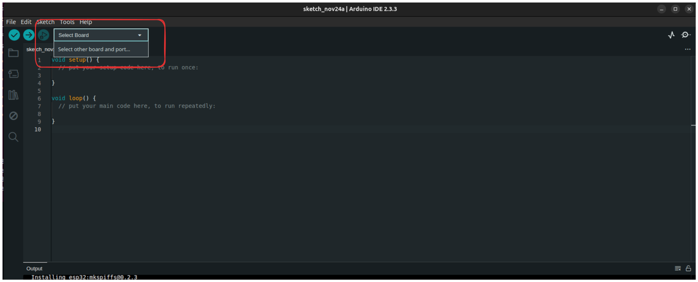

This repository shares information related to the **Devs&Lattes workshop** (2024.11.30) in Shanghai.

## How to Install Arduino for ESP32-C3

1. Go to the [Arduino website](https://www.arduino.cc/en/software) and navigate to the **Software** section.  
   

2. When you open Arduino for the first time, it will download the necessary dependencies.  
   

3. Click on the dropdown menu and select **Select Other Board and Port...**  
   

4. Search for **ESP32-C3 Dev Board**. Click **OK** and close.
   

5. A pop-up message suggesting installation will appear. Click **Yes** to install automatically (no manual installation required).  
   

Congratulations! You are ready for the workshop!

